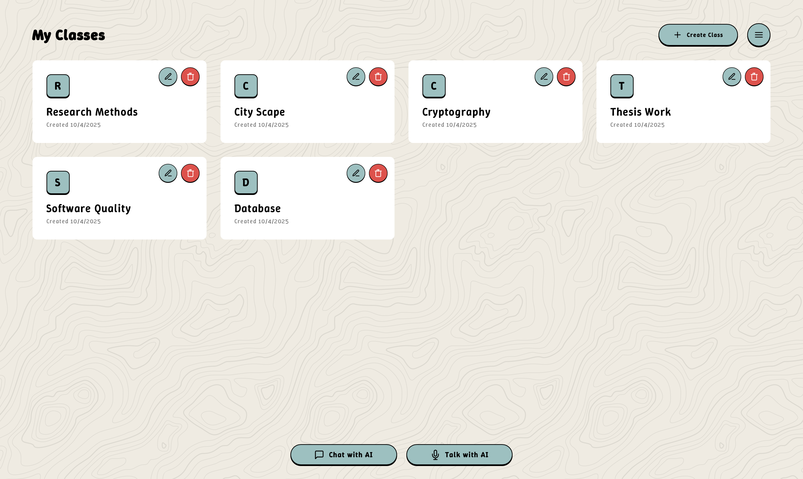
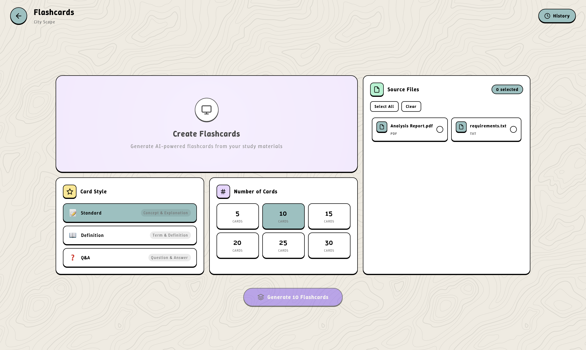

# 🎓 Lumi AI — Your AI Study Assistant

**An AI tutoring platform that helps students learn from their own course materials.**

🔗 **Live:** [studywithlumi.com](https://studywithlumi.com) · 👥 **55+ active students**

Lumi AI lets students upload their class materials, then study with an AI tutor
grounded in _their_ content — answering questions, generating flashcards and
summaries, all scoped to the documents they uploaded.

## ✨ Features

- **AI-powered chat** grounded in your uploaded study materials
- **Document management** — upload and organize materials by class
- **Contextual understanding** — references your specific documents for relevant answers
- **Targeted responses** — select specific documents for focused questions
- **Study tools** — auto-generate flashcards, summaries, and study outlines
- **Conversation history** — save and revisit past AI interactions

## 🏗️ Tech Stack

**Frontend:** React, TypeScript, Vite
**Backend & Data:** Supabase (PostgreSQL, Auth, Storage)
**AI:** OpenAI API, called via a **Supabase Edge Function** so the API key never reaches the client
**Hosting:** Custom domain (studywithlumi.com)

## 🧑‍💻 What I Built

Solo-designed, built, deployed, and operate the full platform end-to-end —
frontend, authentication, database, file storage, AI integration, and production
hosting. OpenAI calls run server-side through a Supabase Edge Function to keep
credentials off the client. Currently serving 55+ active student users.

## 📫 Contact

Phanidhar Akula · [LinkedIn](https://linkedin.com/in/phanidharakula) ·
[phanidhar.dev](https://phanidhar.dev) · phanidharakula@gmail.com
